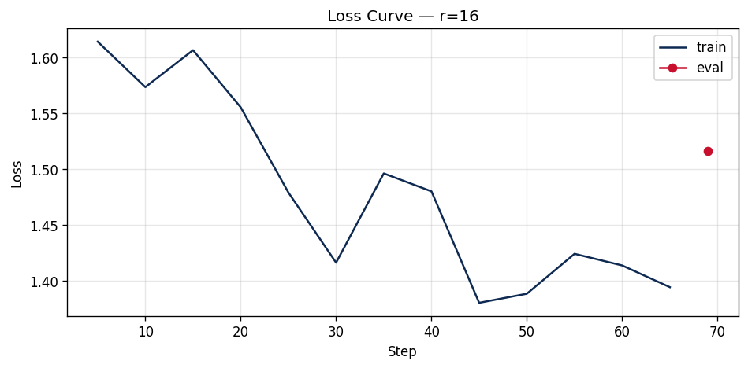

# Lab 21 — Evaluation Report

**Học viên**: Nguyễn Lý Minh Kỳ — 2A202600782  
**Ngày nộp**: 2026-06-26  
**Submission option**: B + C (GitHub + HuggingFace Hub + `requirements.txt`)  
**Notebook**: `notebooks/Lab21_LoRA_Finetuning_T4.ipynb`

## 1. Setup

| Mục | Giá trị |
|---|---|
| **Base model** | `unsloth/Qwen2.5-3B-bnb-4bit` |
| **Fine-tuning method** | QLoRA 4-bit NF4 + PEFT LoRA |
| **Dataset** | `5CD-AI/Vietnamese-alpaca-gpt4-gg-translated`, 200 samples |
| **Split** | 180 train / 20 eval, seed = 42 |
| **Format** | Alpaca: `### Instruction`, `### Input`, `### Response` |
| **Token length** | min = 25, max = 738, p50 = 227, p95 = 562, p99 = 704 |
| **max_seq_length** | 1024 |
| **GPU/runtime** | Tesla T4, 15.6 GB VRAM, Google Colab |
| **Libraries** | Unsloth 2026.6.9, TRL 0.15.2, Transformers 5.5.0, Torch 2.11.0+cu128 |
| **Baseline LoRA config** | `r=16`, `lora_alpha=32`, `target_modules=["q_proj", "v_proj"]`, `lora_dropout=0` |
| **Training hyperparameters** | 3 epochs, LR `2e-4`, cosine schedule, warmup ratio 0.10, batch size 1, grad accumulation 8, effective batch size 8, `adamw_8bit`, `packing=False` |
| **Training cost** | 13.7 minutes for r=8/r=16/r=64, estimated $0.08 at $0.35/hour; actual Colab Free cost = $0 |

Links:
- GitHub: `https://github.com/nekloyh/Day21_T3_2A202600782_NguyenLyMinhKy`
- r=16 adapter: `https://huggingface.co/nekloyh/qwen2.5-3b-vi-lab21-r16`
- W&B run: `https://wandb.ai/nglyminhky2k4-nknk/lab21-lora-rank/runs/sh2uj7vz`

Artifact check: tôi đã mở `lab21_results.zip`; zip này chứa `r16/`, `r8/`, và `loss_curve.png`. Các số liệu r=64, base, qualitative, stretch, và GGUF được lưu trong executed notebook outputs, HuggingFace links, và các file CSV nhỏ dưới `results/`.

## 2. Rank Experiment Results

| Rank | Trainable Params | % of total | Train Time | Peak VRAM | Eval Loss | Perplexity |
|---:|---:|---:|---:|---:|---:|---:|
| Base | 0 | 0.00% | - | - | 1.8666 | 6.466 |
| 8 | 1,843,200 | 0.06% | 4.21 min | 7.22 GB | 1.5577 | 4.748 |
| 16 | 3,686,400 | 0.12% | 5.20 min | 6.62 GB | 1.5161 | 4.554 |
| 64 | 14,745,600 | 0.48% | 4.28 min | 8.00 GB | 1.4768 | 4.379 |

Observations:
- All LoRA ranks improve over the base model: perplexity drops from 6.466 to 4.748/4.554/4.379.
- Increasing rank improves perplexity monotonically, but the gain becomes smaller relative to the parameter increase.
- `r=16` doubles the trainable parameters over `r=8` and improves perplexity by 4.1%.
- `r=64` uses 4x the trainable parameters of `r=16` but improves perplexity by only 3.8%.
- Training time is close across ranks because the experiment is small and the frozen 3B base model dominates forward/backward cost more than the adapter size.

## 3. Loss Curve Analysis

The training loss trends downward through 69 steps. There is normal mini-batch noise, but the later losses stay below the early losses for all rank runs. Because the T4 profile disables mid-training eval to reduce VRAM pressure, overfitting is judged from final eval perplexity and qualitative behavior instead of eval-loss-per-step.

I do not see strong overfitting within 3 epochs. The final eval perplexities are all much lower than the base perplexity, and the qualitative outputs remain fluent. The risk would increase if the same 180 training samples were repeated for more epochs, especially for `r=64`, because it has substantially more capacity than `r=8` or `r=16`.

## 4. Qualitative Comparison

Generation settings: 5 Vietnamese prompts, base model vs fine-tuned `r=16`, `max_new_tokens=200`, `temperature=0.7`, `top_p=0.9`.

| # | Prompt | Base output snippet | Fine-tuned output snippet | Result |
|---:|---|---|---|---|
| 1 | Giải thích khái niệm machine learning cho người mới bắt đầu. | Explains ML as an AI subfield that learns from data to predict or act. | Explains ML as a computer science field that improves predictions from data without direct instructions. | Similar quality; FT wording is slightly cleaner. |
| 2 | Viết đoạn code Python tính số Fibonacci thứ n. | Gives a recursive/loop solution and returns a string for invalid `n`. | Gives code with `raise ValueError` for invalid input and handles `n == 0`. | FT wins: stricter input validation and better code style. |
| 3 | Liệt kê 5 nguyên tắc thiết kế UI/UX. | Gives broad principles such as user friendliness and layout/color clarity. | Gives a concise numbered list: conversion, responsiveness, simplicity, and related principles. | FT wins on structure, though the wording is not perfect. |
| 4 | Tóm tắt sự khác biệt giữa LoRA và QLoRA. | Correctly identifies LoRA as Low-Rank Adaptation and QLoRA as Quantized LoRA. | Incorrectly expands LoRA as "Layer-wise Adaptive Regularization Optimization". | FT loses: clear hallucination on technical knowledge. |
| 5 | Phân biệt prompt engineering, RAG, và fine-tuning. | Explains the three as different methods for improving model behavior. | Explains all three with a more organized comparison and clearer transitions. | FT is slightly better for format and organization. |

Qualitative conclusion: the fine-tuned model improves formatting, concise structure, and coding style, but it does not reliably improve factual knowledge. The LoRA/QLoRA example is the clearest failure case: the base model knows the correct expansion while the fine-tuned adapter hallucinates. This matches the course principle: use fine-tuning for behavior, tone, format, and task style; use RAG for factual knowledge updates.

## 5. Conclusion về Rank Trade-off

For this dataset and runtime, `r=16` is the best practical rank. `r=8` is already much better than the base model, but `r=16` gives a useful perplexity improvement while keeping the adapter small: 3.69M trainable parameters, about 0.12% of the model. `r=64` gives the best perplexity, but it requires 14.75M trainable parameters, which is 4x larger than `r=16`, and only improves perplexity from 4.554 to 4.379. That is a classic diminishing-return pattern: rank increases adapter capacity linearly, but the available training signal is limited by the small 180-sample train set.

If I were deploying this adapter, I would choose `r=16`. It is a good balance between quality, memory, and adapter size, and it keeps multi-adapter serving practical. I would choose `r=8` only if I needed many lightweight adapters in parallel or had strict storage constraints. I would choose `r=64` only after collecting a larger and cleaner dataset where the extra capacity can be used without overfitting. The more important next improvement is not simply increasing rank, but improving dataset quality and coverage.

## 6. What I Learned

- LoRA rank is a capacity control, not a free quality knob. Higher rank can improve perplexity, but the return depends on dataset size and quality.
- QLoRA makes 3B-model fine-tuning feasible on a T4 by freezing the 4-bit base and training only small adapter matrices.
- Fine-tuning mainly teaches response style, structure, and task format. It can still hallucinate factual details, so knowledge-heavy workflows should use RAG or retrieval-backed evaluation.
- Reporting the base model matters. Without the base perplexity, it is easy to overstate the rank comparison; here the base row shows that all three adapters learned something useful.

## 7. Extended Experiments

### 7.1 Target ALL Layers vs Baseline `q+v`

| Variant | Target modules | Trainable Params | Train Time | Peak VRAM | Eval Loss | Perplexity |
|---|---|---:|---:|---:|---:|---:|
| r16 baseline | `q,v` | 3,686,400 | 5.20 min | 6.62 GB | 1.5161 | 4.554 |
| r16 ALL layers | `q,k,v,o,gate,up,down` | 29,933,568 | 5.09 min | 10.59 GB | 1.4948 | 4.459 |

Targeting all layers improves perplexity over the `q+v` baseline, but it uses 8.1x more trainable parameters and about 4 GB more peak VRAM. It is useful when quality is more important than adapter size, but it is not as parameter-efficient as the baseline for this small dataset.

### 7.2 DoRA vs LoRA

| Variant | Trainable Params | Train Time | Peak VRAM | Eval Loss | Perplexity |
|---|---:|---:|---:|---:|---:|
| LoRA r16 `q+v` | 3,686,400 | 5.20 min | 6.62 GB | 1.5161 | 4.554 |
| DoRA r16 `q+v` | 3,769,344 | 4.93 min | 11.53 GB | 1.5162 | 4.555 |

DoRA did not improve this run. It produced essentially the same perplexity as LoRA while using much more VRAM. For this small dataset and short training schedule, standard LoRA is the better choice.

### 7.3 GGUF Export and Hub Links

The `r=16` adapter was merged and exported to GGUF `q4_k_m`. The notebook output reports a successful conversion to `Qwen2.5-3B.Q4_K_M.gguf`.

- ALL-layers r=16: `https://huggingface.co/nekloyh/qwen2.5-3b-vi-lab21-r16-all`
- DoRA r=16: `https://huggingface.co/nekloyh/qwen2.5-3b-vi-lab21-r16-dora`
- GGUF q4_k_m: `https://huggingface.co/nekloyh/qwen2.5-3b-vi-lab21-r16-gguf`

### 7.4 Reproducibility

The notebook saves `rank_experiment_summary.csv`, `qualitative_comparison.csv`, `stretch_comparison.csv`, and `requirements_freeze.txt` to `OUTPUT_DIR`. I also mirrored the key CSVs into `results/` in this repo:

- `results/rank_experiment_summary.csv`
- `results/qualitative_comparison.csv`
- `results/stretch_comparison.csv`
- `results/loss_curve.png`

The repository includes `requirements.txt` for a reproducible environment.
